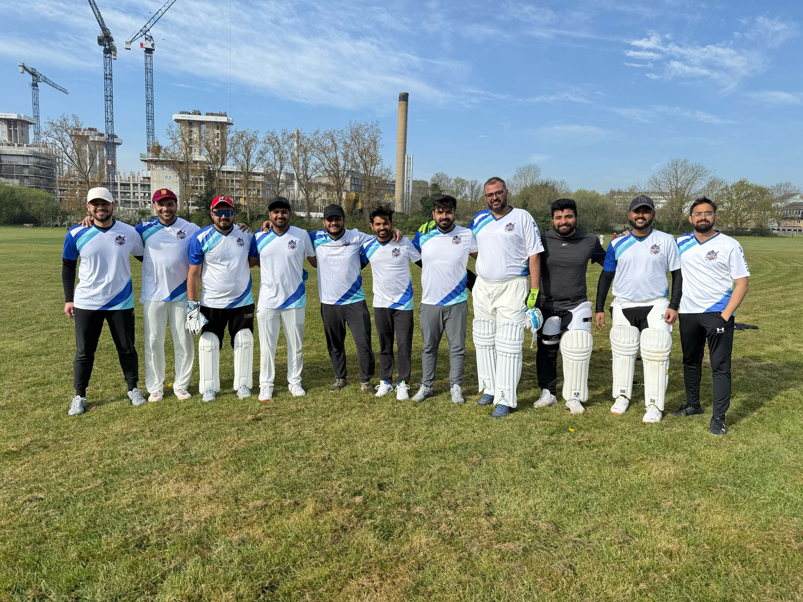

# GQ United Cricket Club Website

A modern, responsive website for GQ United Cricket Club built with Next.js, featuring member management, fixtures, team information, and sponsor showcases.



## 🏏 About GQ United CC

GQ United Cricket Club was founded in 2023 during Ganpati celebrations hosted by Mr. Vishal Soni. What started as gully cricket in April 2023 has grown into an officially registered cricket club with the England and Wales Cricket Board (ECB) as of March 2025. The club is based at Greenford Sports Ground in London and has grown from 5 founding members to 25+ active players.

### Founding Members
- **Vishal Soni** - Club Chairperson
- **Sushant Gupta** - Founding Member
- **Raman Agarwal** - Founding Member  
- **Dhiren Grover** - Founding Member

## 🚀 Features

- **🏠 Landing Page** - Hero section with team photos, stats, and sponsor showcase
- **👥 Team Management** - Complete roster with player profiles and specialties
- **📅 Fixtures & Results** - Match scheduling and results tracking
- **🤝 Sponsors** - Sponsor showcase with partnership opportunities
- **📝 Membership** - Online application system with cricket-specific forms
- **🔐 Authentication** - Secure login system for members
- **📊 Dashboard** - Personalized member dashboard with cricket metrics
- **📱 Responsive Design** - Mobile-first approach with modern UI
- **⚖️ Legal Pages** - Privacy Policy and Terms of Service

## 🛠 Tech Stack

- **Framework**: [Next.js 15](https://nextjs.org/) with App Router
- **Language**: [TypeScript](https://www.typescriptlang.org/)
- **Styling**: [Tailwind CSS](https://tailwindcss.com/)
- **Database**: [PostgreSQL](https://www.postgresql.org/) with [Vercel Postgres](https://vercel.com/storage/postgres)
- **Authentication**: [NextAuth.js](https://next-auth.js.org/)
- **Password Hashing**: [bcryptjs](https://www.npmjs.com/package/bcryptjs)
- **Icons**: [Heroicons](https://heroicons.com/)
- **Fonts**: [Inter](https://fonts.google.com/specimen/Inter) & [Lusitana](https://fonts.google.com/specimen/Lusitana)
- **Package Manager**: [pnpm](https://pnpm.io/)
- **Deployment**: [Vercel](https://vercel.com/)

## 📋 Prerequisites

Before you begin, ensure you have the following installed:

- **Node.js** (v18.17 or later)
- **pnpm** (v8.0 or later)
- **Git**
- **PostgreSQL** (for local development) or access to Vercel Postgres

## 🚀 Getting Started

### 1. Clone the Repository

```bash
git clone https://github.com/sushant4nt/next-js-dashboard.git
cd next-js-dashboard
```

### 2. Install Dependencies

```bash
pnpm install
```

### 3. Environment Setup

Create a `.env.local` file in the root directory:

```env
# Database
POSTGRES_URL="your_postgres_connection_string"
POSTGRES_PRISMA_URL="your_postgres_prisma_url"
POSTGRES_URL_NO_SSL="your_postgres_url_no_ssl"
POSTGRES_URL_NON_POOLING="your_postgres_url_non_pooling"
POSTGRES_USER="your_postgres_user"
POSTGRES_HOST="your_postgres_host"
POSTGRES_PASSWORD="your_postgres_password"
POSTGRES_DATABASE="your_postgres_database"

# Authentication
AUTH_SECRET="your_auth_secret_key"
AUTH_URL="http://localhost:3000/api/auth"
```

### 4. Database Setup

#### Option A: Using Vercel Postgres (Recommended)
1. Create a [Vercel account](https://vercel.com/)
2. Create a new Postgres database in Vercel
3. Copy the connection strings to your `.env.local`

#### Option B: Local PostgreSQL
1. Install PostgreSQL locally
2. Create a database named `gq_united_cc`
3. Update the connection strings in `.env.local`

### 5. Seed the Database

```bash
# This will create tables and populate with sample data
pnpm run seed
```

Or visit `http://localhost:3000/seed` after starting the development server.

### 6. Start Development Server

```bash
pnpm dev
```

Open [http://localhost:3000](http://localhost:3000) in your browser.

## 📁 Project Structure

```
├── app/                    # Next.js App Router
│   ├── (auth)/            # Authentication routes
│   ├── dashboard/         # Protected dashboard pages
│   ├── lib/               # Utility functions and data
│   ├── ui/                # Reusable UI components
│   ├── about/             # About page
│   ├── fixtures/          # Fixtures page
│   ├── join/              # Membership application
│   ├── privacy/           # Privacy policy
│   ├── sponsors/          # Sponsors page
│   ├── teams/             # Team roster
│   ├── terms/             # Terms of service
│   └── page.tsx           # Landing page
├── public/                # Static assets
│   ├── teampic.png        # Team photos
│   ├── gbs-logo.png       # Sponsor logos
│   └── ...
├── auth.ts                # Authentication configuration
├── middleware.ts          # Route protection
└── tailwind.config.ts     # Tailwind configuration
```

## 🎨 Key Components

### Landing Page (`app/page.tsx`)
- Hero section with team photo
- Club statistics (matches, members, years)
- About preview with yoga/fitness photos
- Sponsor showcase (GBS & SocialUntold)
- Call-to-action for membership

### Team Management (`app/teams/page.tsx`)
- Complete roster of 24+ members
- Founding members section
- Player specialties and experience levels
- Team statistics and achievements

### Fixtures (`app/fixtures/page.tsx`)
- Upcoming matches with detailed information
- Recent results and league standings
- International Yoga Day event
- Match venues and timings

### Authentication (`auth.ts`)
- Secure login with bcryptjs password hashing
- Session management with NextAuth.js
- Protected routes for member dashboard

## 🔧 Development

### Available Scripts

```bash
# Development
pnpm dev          # Start development server
pnpm build        # Build for production
pnpm start        # Start production server
pnpm lint         # Run ESLint

# Database
pnpm run seed     # Seed database with sample data
```

### Code Style

- **TypeScript** for type safety
- **ESLint** for code linting
- **Prettier** for code formatting (recommended)
- **Tailwind CSS** for styling with mobile-first approach

### Database Schema

#### Users Table
```sql
CREATE TABLE users (
  id UUID DEFAULT gen_random_uuid() PRIMARY KEY,
  name VARCHAR(255) NOT NULL,
  email TEXT NOT NULL UNIQUE,
  password TEXT NOT NULL,
  role VARCHAR(50) DEFAULT 'member',
  experience VARCHAR(50),
  specialty VARCHAR(100),
  phone VARCHAR(20),
  join_date DATE DEFAULT CURRENT_DATE
);
```

#### Fixtures Table
```sql
CREATE TABLE fixtures (
  id UUID DEFAULT gen_random_uuid() PRIMARY KEY,
  opponent VARCHAR(255) NOT NULL,
  date DATE NOT NULL,
  venue VARCHAR(255) NOT NULL,
  match_type VARCHAR(100),
  status VARCHAR(50) DEFAULT 'upcoming'
);
```

## 🤝 Contributing

We welcome contributions from the cricket community! Here's how you can help:

### 1. Fork the Repository

Click the "Fork" button on GitHub to create your own copy.

### 2. Create a Feature Branch

```bash
git checkout -b feature/your-feature-name
```

### 3. Make Your Changes

- Follow the existing code style
- Add TypeScript types for new features
- Ensure responsive design for mobile devices
- Test your changes thoroughly

### 4. Commit Your Changes

```bash
git add .
git commit -m "feat: add your feature description"
```

Use conventional commit messages:
- `feat:` for new features
- `fix:` for bug fixes
- `docs:` for documentation
- `style:` for formatting changes
- `refactor:` for code refactoring

### 5. Push and Create Pull Request

```bash
git push origin feature/your-feature-name
```

Then create a Pull Request on GitHub with:
- Clear description of changes
- Screenshots for UI changes
- Test instructions
- Link to any related issues

### Contribution Guidelines

- **Code Quality**: Ensure TypeScript types and ESLint passes
- **Testing**: Test on mobile and desktop devices
- **Documentation**: Update README if adding new features
- **Cricket Focus**: Keep features relevant to cricket club operations
- **Responsive Design**: Maintain mobile-first approach

## 🐛 Debugging

### Common Issues

1. **Database Connection Errors**
   ```bash
   # Check environment variables
   echo $POSTGRES_URL
   
   # Test database connection
   pnpm run seed
   ```

2. **Authentication Issues**
   ```bash
   # Verify AUTH_SECRET is set
   echo $AUTH_SECRET
   
   # Clear browser cookies and try again
   ```

3. **Build Errors**
   ```bash
   # Clear Next.js cache
   rm -rf .next
   pnpm build
   ```

4. **Styling Issues**
   ```bash
   # Rebuild Tailwind CSS
   pnpm dev
   ```

### Development Tools

- **Next.js DevTools**: Built-in development features
- **React Developer Tools**: Browser extension for React debugging
- **Vercel CLI**: For deployment testing
- **PostgreSQL Admin**: For database management

## 📱 Mobile Responsiveness

The website is built with a mobile-first approach:

- **Breakpoints**: `sm:` (640px), `md:` (768px), `lg:` (1024px), `xl:` (1280px)
- **Navigation**: Hamburger menu for mobile devices
- **Images**: Responsive with Next.js Image optimization
- **Typography**: Scalable text sizes across devices
- **Touch Targets**: Minimum 44px for mobile interaction

## 🔒 Security

- **Password Hashing**: bcryptjs with salt rounds
- **Session Management**: Secure HTTP-only cookies
- **CSRF Protection**: Built-in NextAuth.js protection
- **Environment Variables**: Sensitive data in `.env.local`
- **Route Protection**: Middleware for authenticated routes

## 🚀 Deployment

### Vercel (Recommended)

1. **Connect Repository**
   - Import project from GitHub
   - Vercel auto-detects Next.js configuration

2. **Environment Variables**
   - Add all `.env.local` variables in Vercel dashboard
   - Include database connection strings

3. **Database Setup**
   - Use Vercel Postgres for production
   - Run seed script after deployment

4. **Custom Domain** (Optional)
   - Add custom domain in Vercel settings
   - Configure DNS records

### Manual Deployment

```bash
# Build the project
pnpm build

# Start production server
pnpm start
```

## 📊 Analytics & Monitoring

- **Vercel Analytics**: Built-in performance monitoring
- **Error Tracking**: Consider adding Sentry for production
- **Performance**: Lighthouse scores optimization
- **SEO**: Meta tags and structured data

## 🤔 FAQ

**Q: How do I add new team members?**
A: Update the `users` array in `app/lib/placeholder-data.ts` and run the seed script.

**Q: How do I update fixtures?**
A: Modify the fixtures data in `app/fixtures/page.tsx` or implement a CMS.

**Q: Can I customize the club branding?**
A: Yes! Update colors in `tailwind.config.ts` and replace logos in the `public/` folder.

**Q: How do I add new sponsors?**
A: Update the sponsors section in `app/sponsors/page.tsx` and `app/page.tsx`.

## 📞 Support

- **GitHub Issues**: Report bugs and request features
- **Email**: info@gqunitedcc.com
- **Documentation**: Check this README and code comments

## 📄 License

This project is open source and available under the [MIT License](LICENSE).

## 🙏 Acknowledgments

- **GQ United CC Members**: For their support and feedback
- **Global Banking School**: Title sponsor supporting player development
- **SocialUntold**: Digital marketing partner
- **Next.js Team**: For the amazing framework
- **Vercel**: For hosting and database services

---

**Built with ❤️ for the cricket community by GQ United CC**

*Ready to contribute? Check out our [contribution guidelines](#-contributing) and join our cricket family!*
